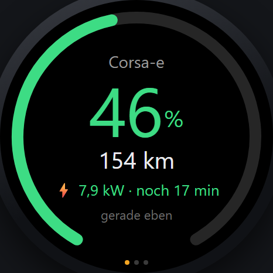
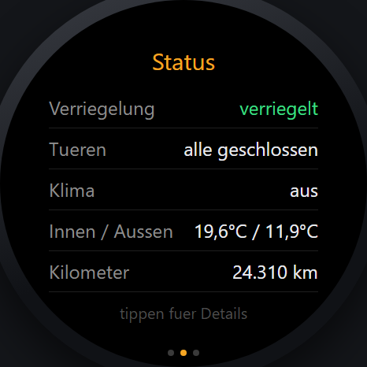
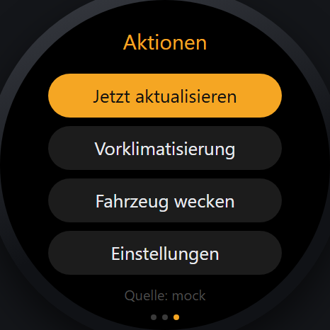
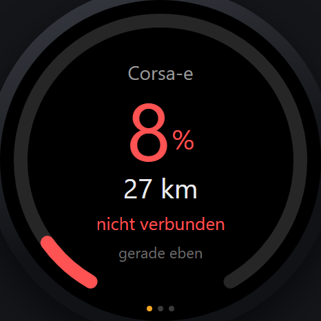
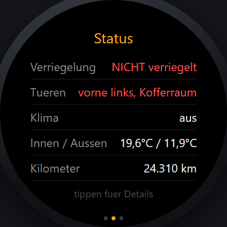
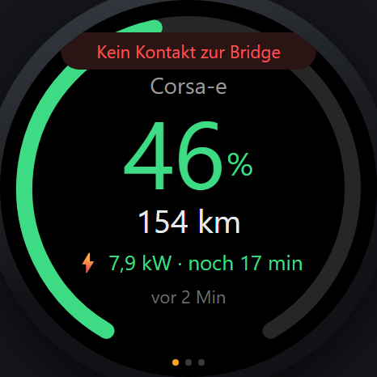
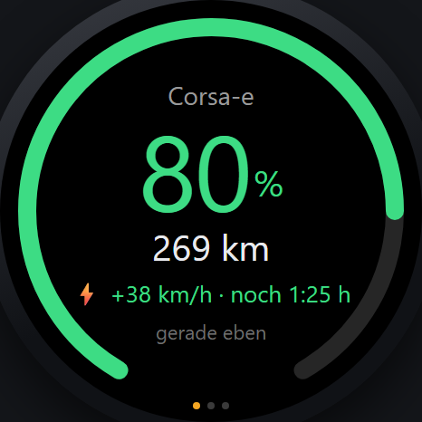

# Opel Connect auf der Huawei Watch GT6

Zeigt Ladestand, Reichweite, Verriegelung, Klima und Kilometerstand des Opel
direkt auf der Uhr.

Die Uhr hat fuer Apps **kein eigenes IP-Networking**. Jeder `fetch` der
Uhr-App wird von Huawei Health durch das gekoppelte Telefon geleitet. Es
braucht also eine Gegenstelle, die das Telefon erreicht - dafuer gibt es zwei
Varianten:

```
 A) ohne PC:                                B) mit Server im Haus:

  Uhr  --Health/BT-->  Android-App           Uhr --Health/BT--> Telefon --WLAN-->
                       (Telefon)                                        Bridge (PC/NAS)
                            |                                               |
                            v                                               v
                   api.groupe-psa.com                            api.groupe-psa.com
```

| Teil | Wo | Aufgabe |
| --- | --- | --- |
| **Watch-App** (`watchapp/`) | Huawei Watch GT6 | Drei Karten zum Wischen, Details, Einstellungen |
| **Android-App** (`androidapp/`) | Telefon | Login, Token-Erneuerung, HTTP-Server fuer die Uhr |
| **Bridge** (`bridge/`) | PC, NAS, Raspberry Pi | Dasselbe fuer den Serverbetrieb, zusaetzlich Fernbefehle |

Beide Gegenstellen liefern **dasselbe JSON**, die Uhr-App ist identisch. Ein
Test haelt das automatisch konsistent
(`bridge/tests/test_android_consistency.py`).

## So sieht es aus

| Energie | Status | Aktionen |
| --- | --- | --- |
|  |  |  |

| Akku niedrig | Tuer offen | Keine Verbindung |
| --- | --- | --- |
|  |  |  |

Am Lader, so wie die echte Opel-Schnittstelle es meldet (km/h statt kW, weil
die API keine Ladeleistung liefert):



Echte Aufnahmen der mitgelieferten Vorschau (`tools/preview.html`), die
dieselbe Formatierlogik benutzt wie die Uhr.

## Schnellstart

### Variante A: nur Telefon und Uhr

1. `androidapp` in Android Studio oeffnen und auf dem Telefon installieren.
2. In der App bei Opel anmelden (der eingebettete Browser faengt die
   Rueckleitung selbst ab - nichts abtippen).
3. *Fuer config.js kopieren* antippen, die zwei Zeilen in
   `watchapp/entry/src/main/js/default/common/config.js` einsetzen.
4. Uhr-App bauen und installieren.

Ausfuehrlich: [docs/ANDROID-APP.md](docs/ANDROID-APP.md).

### Variante B: Bridge auf einem Rechner

```bat
cd bridge
start-bridge.cmd
```

Laeuft sofort mit einem **simulierten Fahrzeug** (`provider: mock`), sodass
sich Uhr-App und Vorschau ohne Opel-Konto testen lassen. Beim ersten Start
entsteht `bridge/config.json` mit einem zufaelligen Token; die Konsole zeigt
die fertige Uhr-URL.

Im Browser pruefen: `http://127.0.0.1:8787/` (Status) und
`http://127.0.0.1:8787/preview` (Uhr-Vorschau mit Testknoepfen).

Fuer echte Daten den Provider umstellen - am einfachsten auf die eigene
Bibliothek `opelapi`:

```json
{ "provider": "opelapi", "allow_commands": true }
```

Alle Wege inklusive Login: [docs/OPEL-CONNECT-SETUP.md](docs/OPEL-CONNECT-SETUP.md).

### Watch-App

`BASE_URL` und `TOKEN` in `watchapp/.../common/config.js` eintragen, dann:

```bat
py tools\check_watchapp.py
```

Das prueft Syntax, ES5-Konformitaet, HML, JSON und die Konfiguration. Bauen
und Installieren: [docs/INSTALL-WATCH.md](docs/INSTALL-WATCH.md).

## Bedienung auf der Uhr

* **Wischen** - zwischen Energie, Status und Aktionen wechseln
* **Karte 2 antippen** - Detailliste (Position, Ladeziel, Restzeit, Quelle)
* **Karte 3** - sofort aktualisieren, Vorklimatisierung, Fahrzeug wecken,
  Einstellungen (Intervall, Einheiten, Vibration, Verbindungstest)
* Letzter Stand wird auf der Uhr zwischengespeichert: beim Start sofort
  sichtbar, bei zu hohem Alter als veraltet markiert
* Endet ein Ladevorgang, waehrend die App offen ist, vibriert die Uhr einmal

Fernbefehle gibt es nur ueber die Bridge mit Provider `opelapi` oder `psacc`;
die Android-App meldet dafuer sauber "nicht unterstuetzt" (Stellantis
verlangt dort MQTT mit OTP-Geraeteschluessel).

## Projektaufbau

```
watchapp/                   HarmonyOS-Lite-Wearable-Projekt (DevEco Studio)
  entry/src/main/js/default/
    common/config.js        >>> HIER URL UND TOKEN EINTRAGEN <<<
    common/api.js           Netzwerk, Cache, Einstellungen
    common/util.js          Formatierung (auch von der Vorschau genutzt)
    pages/index             Hauptseite mit drei Karten
    pages/detail            Detailliste
    pages/settings          Einstellungen
androidapp/                 Android-Bruecke (Kotlin, ohne Fremdbibliotheken)
  app/src/main/java/de/saigak/opelbridge/
    OpelApi.kt              OAuth-Login, Token-Erneuerung, Fahrzeugdaten
    Normalize.kt            Rohantwort -> Uhr-JSON
    WatchServer.kt          HTTP-Server fuer die Uhr
    BridgeService.kt        Vordergrunddienst mit Abfrageschleife
    LoginActivity.kt        Anmeldung im WebView (beide Wege)
bridge/                     Python-Bridge, nur Standardbibliothek
  opelbridge/
    server.py               HTTP-Server, Token-Pruefung, Poller
    model.py                Normalisiertes Fahrzeugmodell (+ Uhr-Format)
    providers/
      opelapi_provider.py   Bibliothek 'opelapi' (empfohlen, kann Befehle)
      psacc.py              psa_car_controller
      stellantis.py         Direkte Stellantis-API
      mock.py               Simuliertes Fahrzeug
  tests/                    36 Tests (30 ohne installierte opelapi-Bibliothek)
tools/
  preview.html              Uhr-Simulator im Browser
  check_watchapp.py         Statische Pruefung vor dem Bauen
docs/                       Anleitungen
```

## Tests

```bat
cd bridge
py -m pytest tests -q         :: Normalisierung, HTTP-API, Provider, Konsistenz
cd ..
py tools\check_watchapp.py    :: Watch-App: Syntax, ES5, HML, JSON, Seiten
```

Die Tests laufen ohne Opel-Konto. Die Abbildung der echten API wird gegen das
Modell der Bibliothek `opelapi` geprueft, sobald diese installiert ist -
sonst wird dieser Teil uebersprungen.

## Dauerbetrieb der Bridge

**Windows:** `schtasks /create /tn "Opel Bridge" /tr "py -m opelbridge" /sc onlogon /rl highest`
(Arbeitsverzeichnis auf `...\hwgt6\bridge` setzen)

**Linux (systemd):**

```ini
[Unit]
Description=Opel Bridge fuer Huawei Watch GT6
After=network-online.target

[Service]
WorkingDirectory=/opt/hwgt6/bridge
ExecStart=/usr/bin/python3 -m opelbridge
Restart=always
RestartSec=20

[Install]
WantedBy=multi-user.target
```

**Docker:** `docker compose up -d` (Konfiguration landet in `./data/config.json`)

## Sicherheit

* Jeder Zugriff braucht das Token aus `bridge/config.json` bzw. aus der
  Android-App; verglichen wird zeitkonstant.
* `bridge/config.json`, `state.json` und die Tokens der App enthalten
  Zugangsdaten zum Fahrzeug. Die Dateien stehen in `.gitignore` und gehoeren
  nicht in ein Repository.
* Fernbefehle sind mit `allow_commands: false` abgeschaltet.
* Von unterwegs: nicht den Port ins Internet weiterleiten, sondern VPN
  (WireGuard/Tailscale) oder Reverse Proxy mit HTTPS. `tls_cert`/`tls_key`
  ermoeglichen auch direktes HTTPS.

## Grenzen

* **Keine offizielle Opel-Schnittstelle.** Stellantis kann sie jederzeit
  aendern; dann muss `providers/` bzw. `OpelApi.kt` nachgezogen werden - die
  Uhr bleibt unberuehrt.
* **Daten sind so frisch, wie das Fahrzeug sie meldet.** "vor 3 Std" ist bei
  einem parkenden Auto normal. Zu haeufiges Abfragen weckt das Modem und
  kostet Starterbatterie; 5 Minuten sind bewusst konservativ.
* **Die Uhr-App laeuft nur, solange sie offen ist.** Lite-Wearable-Apps
  duerfen auf der GT-Serie nicht dauerhaft im Hintergrund funken.
* **Installation auf der Uhr braucht ein Huawei-Entwicklerkonto.** Apps fuer
  die GT-Serie muessen signiert werden, ein Sideload wie bei Android gibt es
  nicht. Siehe [docs/INSTALL-WATCH.md](docs/INSTALL-WATCH.md).
