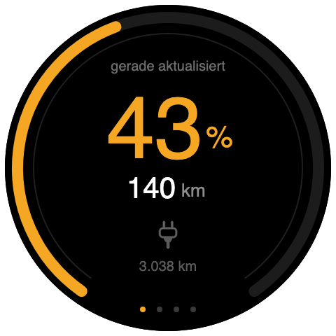
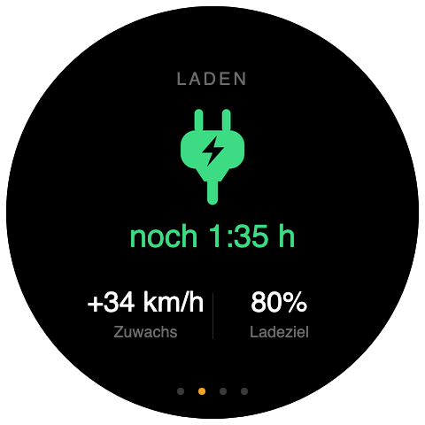
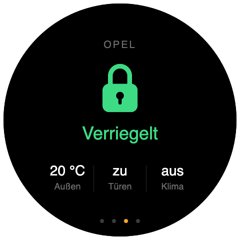
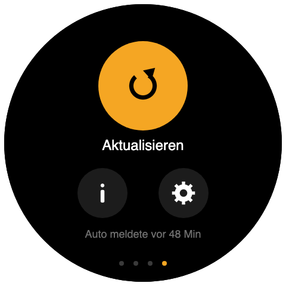
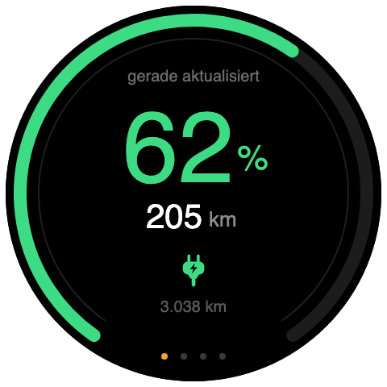
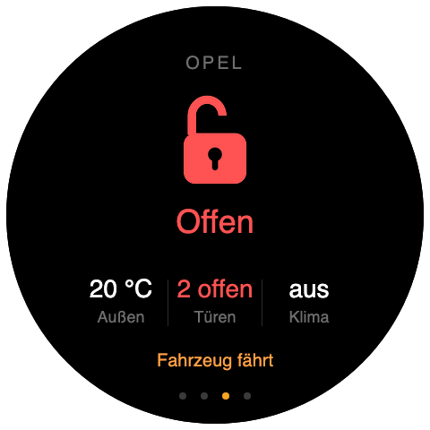
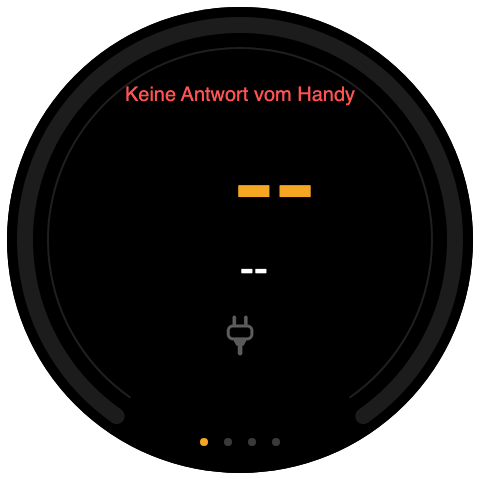
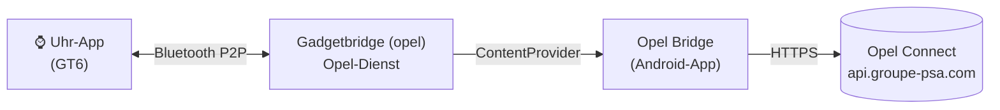

<div align="center">

# Opel Connect auf der Huawei Watch GT6

**Ladestand, Reichweite, Stecker, Schloss und Kilometerstand deines Opel direkt am Handgelenk.**
Ohne Huawei Health, ohne AppGallery-Freigabe, ohne Identitätsprüfung.

 <br>
 

**Weitere Zustände:** lädt · Tür offen · Handy nicht erreichbar

  

</div>

---

## Was es ist

Eine eigene App für die **Huawei Watch GT6**, die die Daten aus **Opel Connect**
(Stellantis) anzeigt – vier Karten zum Wischen, mit animiertem Ladering und
pulsierendem Ladesymbol:

| Karte | Inhalt |
| --- | --- |
| **Übersicht** | großer Ladestand, Reichweite, Stecker-Symbol, Kilometerstand, „gerade aktualisiert“ |
| **Laden** | Restzeit, Reichweitenzuwachs (km/h), Ladeziel – oder Akku und Reichweite, wenn nicht geladen wird |
| **Fahrzeug** | Verriegelt/Offen, Türen, Außentemperatur, Klima; antippen für alle Details |
| **Menü** | Aktualisieren, Details, Einstellungen, wann das Auto zuletzt gemeldet hat |

## So funktioniert es

Die GT6 hat für Apps **keinen Netzzugang** – auch nicht über das Handy. Der
einzige Weg in eine Uhr-App ist Huaweis Bluetooth-P2P-Kanal. Offiziell läuft
der über Huawei Health und eine AppGallery-Freigabe (mit Identitätsprüfung).
Dieses Projekt nimmt stattdessen **[Gadgetbridge](https://gadgetbridge.org)**,
das Huaweis Bluetooth-Protokoll quelloffen nachgebaut hat, und ergänzt einen
kleinen Opel-Dienst:



| Teil | Ordner | Aufgabe |
| --- | --- | --- |
| **Uhr-App** | [`watchapp/`](watchapp) | Lite-Wearable-App (JS/HML), vier Karten, Details, Einstellungen |
| **Gadgetbridge (opel)** | [`gadgetbridge/`](gadgetbridge) | Patch für Gadgetbridge: nimmt Anfragen der Uhr an und reicht sie weiter |
| **Opel Bridge** | [`androidapp/`](androidapp) | Opel-Login, Token-Erneuerung, holt die Fahrzeugdaten |
| **PC-Bridge** *(optional)* | [`bridge/`](bridge) | Python-Server für Vorschau, Tests und Fernbefehle am Rechner |

Android startet die Opel Bridge bei jeder Anfrage selbst – sie muss nicht
geöffnet sein und übersteht auch den Akku-Manager von Honor/Huawei.

## Einrichten

Drei Schritte, jeweils mit eigener Anleitung:

1. **[Opel Bridge installieren und bei Opel anmelden](docs/ANDROID-APP.md)**
2. **[Gadgetbridge (opel) bauen und die Uhr koppeln](docs/GADGETBRIDGE.md)**
3. **[Uhr-App bauen, signieren und installieren](docs/INSTALL-WATCH.md)**

Kurzfassung für macOS, wenn Android SDK, OpenJDK 21 und DevEco Studio schon da sind:

```bash
# 1. Opel Bridge
cd androidapp && ./gradlew assembleDebug && adb install -r app/build/outputs/apk/debug/app-debug.apk

# 2. Gadgetbridge (opel)
cd ../gadgetbridge && ./build.sh --install

# 3. Uhr-App -> dist/OpelWatch.fw, dann in Gadgetbridge über den Datei-Installer auf die Uhr
cd ../watchapp && ./build-watch.sh && ./sign-watch.sh 6
```

## Bedienung

* **Wischen** wechselt die Karten, die Punkte unten zeigen, wo du bist.
* **Aktualisieren** (Menü) fragt sofort frisch bei Opel an – wie das Herunterziehen in der Opel-App.
* **„gerade aktualisiert“** oben auf Karte 1 ist der Abruf bei Opel; **„Auto meldete vor …“**
  im Menü ist die letzte Meldung des Autos selbst. Ein geparktes Auto meldet sich selten –
  das ist normal.
* Solange die App offen ist, aktualisiert sie jede Minute (beim Laden alle 30 s) und
  vibriert, wenn ein Ladevorgang endet.

## Projektaufbau

```
watchapp/                  Uhr-App (HarmonyOS Lite Wearable, DevEco/hvigor)
  entry/src/main/js/default/
    common/api.js          Anfragen, Zwischenspeicher, Einstellungen
    common/p2p.js          Bluetooth-P2P zur Gegenstelle auf dem Handy
    common/util.js         Formatierung (auch von tools/preview.html genutzt)
    common/images/         Icons (Stecker, Schloss, Menü)
    pages/index            die vier Karten
    pages/detail           Detailliste
    pages/settings         Einstellungen und Verbindungstest
  build-watch.sh           bauen ohne IDE
  sign-watch.sh            Paket für die GT-Serie umschreiben und signieren
gadgetbridge/
  hwgt6-opel.patch         Änderungen an Gadgetbridge (Opel-Dienst, eigener Paketname)
  build.sh                 klont Gadgetbridge, wendet den Patch an, baut
androidapp/                Opel Bridge (Kotlin, ohne Fremdbibliotheken)
  .../OpelApi.kt           OAuth-Login, Token-Erneuerung, Fahrzeugstatus
  .../Normalize.kt         Opel-Antwort -> kompaktes Uhr-JSON
  .../VehicleData.kt       Abruf und Zwischenspeicher
  .../WatchProvider.kt     Schnittstelle für Gadgetbridge
bridge/                    PC-Bridge (Python, nur Standardbibliothek) + Tests
tools/                     check_watchapp.py, Browser-Vorschau
docs/                      Anleitungen
```

## Tests

```bash
cd bridge && python3 -m pytest tests -q     # Normalisierung, HTTP-API, Provider, Konsistenz
cd .. && python3 tools/check_watchapp.py    # Uhr-App: ES5, ASCII, HML, JSON, Seiten
```

Das Datenformat für die Uhr (26 kurze Felder, < 700 Byte) ist an drei Stellen
implementiert – PC-Bridge, Opel Bridge, Uhr-App. Ein Test hält sie
automatisch deckungsgleich. Feldbedeutungen: [docs/API.md](docs/API.md).

## Grenzen

* **Keine offizielle Schnittstelle.** Stellantis kann die API jederzeit ändern;
  nachgezogen wird dann nur in `OpelApi.kt` bzw. `bridge/opelbridge/providers/`.
* **Daten sind so frisch, wie das Auto sie meldet.** Aktualisieren holt den
  neuesten Stand bei Opel, weckt das Auto aber nicht.
* **Keine Fernbefehle** über die Uhr (Klima, Verriegeln) – bewusst, um das
  Opel-Konto nicht mit Geräteregistrierungen zu gefährden.
* **Die Uhr-App aktualisiert nur, solange sie offen ist** – Lite-Wearable-Apps
  dürfen auf der GT-Serie nicht im Hintergrund funken.
* **Eigene Zifferblätter (.hwt)** lassen sich über Gadgetbridge auf der GT6
  derzeit nicht installieren (die Uhr nimmt die Datei an, übernimmt sie aber nicht).

## Sicherheit

`bridge/config.json`, `bridge/state.json`, die Signaturschlüssel in
`watchapp/signing/` und die Tokens der Opel Bridge enthalten Zugang zum
Fahrzeug bzw. zur Signatur – alles steht in `.gitignore`. Die Opel Bridge
beantwortet Provider-Aufrufe nur von Gadgetbridge; Tokens werden nie
protokolliert oder ausgegeben.

## Lizenz und Dank

Der Gadgetbridge-Patch steht wie Gadgetbridge unter der **AGPL-3.0**.
Dank an das [Gadgetbridge-Team](https://codeberg.org/Freeyourgadget/Gadgetbridge)
für das offene Huawei-Protokoll – ohne das gäbe es diesen Weg nicht.
