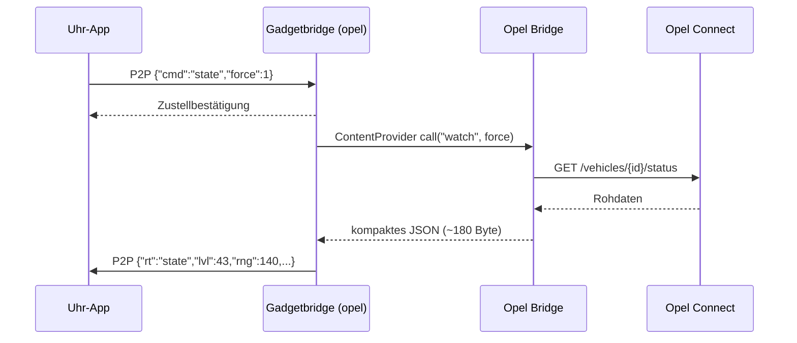

# Gadgetbridge (opel): die Verbindung zur Uhr

Die Uhr-App kann nur über Huaweis Bluetooth-P2P-Kanal (Wear Engine,
Dienst `0x34`) Daten bekommen. Huawei Health lässt diesen Kanal nur für Apps
zu, die in AppGallery Connect freigeschaltet sind (Identitätsprüfung nötig).
[Gadgetbridge](https://gadgetbridge.org) spricht das Huawei-Protokoll selbst
und prüft keine Freigabe – die Uhr vergleicht nur Paketnamen und
Fingerabdrücke als Text.

Dieses Projekt ergänzt Gadgetbridge um einen **Opel-Dienst** und baut es als
eigene App **„Gadgetbridge (opel)“** (`nodomain.freeyourgadget.gadgetbridge.opel`).
Sie lässt sich neben einer normalen Gadgetbridge installieren.

## Was der Patch ändert

`gadgetbridge/hwgt6-opel.patch`, getestet auf Gadgetbridge-master
`e2ef406c` (2026-09-21):

| Datei | Änderung |
| --- | --- |
| `p2p/HuaweiP2POpelService.java` *(neu)* | Opel-Dienst: nimmt `{"cmd":"state"\|"info"\|"log"}` von der Uhr an, holt die Antwort bei der Opel Bridge und schickt sie zurück |
| `HuaweiSupportProvider.java` | registriert den Dienst, sobald Daten fließen (die übliche Init-Stufe läuft auf der GT6 nicht zuverlässig durch) |
| `ControlCenterv2.java` | verbindet beim Öffnen automatisch die gekoppelte Uhr |
| `app/build.gradle`, `mainline/strings.xml` | eigener Paketname `.opel` und eigener Provider-Name, damit sie neben der normalen Gadgetbridge installierbar ist |
| `mainline/AndroidManifest.xml` *(neu)* | Netzwerk-Berechtigung (HTTP-Rückfall) und Sichtbarkeit des Opel-Bridge-Providers |

## Bauen

Voraussetzungen (macOS, Homebrew):

```bash
brew install openjdk@21          # braucht jlink - das JBR aus DevEco reicht nicht
sdkmanager "platforms;android-37.0" "build-tools;37.0.0"
```

Dann:

```bash
cd gadgetbridge
./build.sh              # klont Gadgetbridge nach gadgetbridge/src, patcht, baut
./build.sh --install    # zusätzlich per adb aufs Telefon
```

Ergebnis: `dist/Gadgetbridge-gt6-opel.apk`. Der erste Lauf lädt Gradle und
alle Abhängigkeiten und dauert entsprechend; danach geht es in unter einer
Minute. `JAVA_HOME` und `ANDROID_HOME` lassen sich per Umgebungsvariable
überschreiben.

## Uhr koppeln

> Die Uhr kann immer nur mit **einer** App verbunden sein. Ist sie noch mit
> Huawei Health gekoppelt, muss sie dort erst getrennt werden – bei der GT6
> heißt das in der Regel: Uhr zurücksetzen. Danach lässt sich die Verbindung
> in Gadgetbridge beliebig oft trennen und wiederherstellen.

1. **Gadgetbridge (opel)** öffnen, Berechtigungen erteilen (Bluetooth,
   Benachrichtigungen, Standort für die Suche).
2. **+** → Uhr in der Liste antippen → koppeln. Die Uhr fragt nach einer
   Bestätigung.
3. Gerät antippen → **Verbinden**. Ab dann verbindet sich die App beim
   Öffnen selbst.
4. **Akku:** Einstellungen → Apps → Gadgetbridge (opel) → Akku →
   *Uneingeschränkt*. Per adb geht es auch so:

   ```bash
   adb shell dumpsys deviceidle whitelist +nodomain.freeyourgadget.gadgetbridge.opel
   ```

## Uhr-App installieren

Die signierte Uhr-App (`dist/OpelWatch.fw`, siehe
[INSTALL-WATCH.md](INSTALL-WATCH.md)) aufs Telefon kopieren, dann:

**Gadgetbridge (opel) → ⋮ beim Gerät → Datei-Installer → `OpelWatch.fw` → Installieren**

Die App erscheint danach unter *App-Manager → Installierte Apps* und in der
App-Liste der Uhr als **Opel Watch**.

## Wie eine Anfrage läuft



Einzelheiten, die Zeit gekostet haben:

* **Fingerabdrücke:** Die Uhr prüft, ob Absender und Empfänger genau die
  Texte tragen, die die Uhr-App mit `setPackageName`/`setFingerprint`
  angemeldet hat. Der Dienst verwendet deshalb exakt die Werte, die die Uhr
  selbst sendet: Telefon `UniteDeviceManagement`, Uhr
  `de.saigak.opelwatch_<Base64 des öffentlichen Schlüssels>`. Der Schlüssel
  ändert sich nicht, wenn das Debug-Zertifikat erneuert wird.
* **Nachrichtengröße:** Antworten an die Uhr werden ab etwa 200 Byte
  abgeschnitten. Der Dienst entfernt deshalb leere Felder und Metadaten und
  kürzt Koordinaten auf vier Nachkommastellen.
* **ContentProvider statt HTTP:** Android startet die Opel Bridge für einen
  Provider-Aufruf selbst, auch wenn der Akku-Manager sie beendet hat. Der
  HTTP-Weg (`127.0.0.1:8787`) bleibt nur als Rückfall.

## Fehlersuche

Der Dienst schreibt ein kurzes Protokoll, weil `logcat` auf Honor-Geräten
gesperrt ist:

```bash
adb shell run-as nodomain.freeyourgadget.gadgetbridge.opel cat files/opelprobe.txt
```

| Eintrag | Bedeutung |
| --- | --- |
| `Opel-Dienst registriert` | Gadgetbridge ist verbunden, der Dienst lauscht |
| `Uhr 'state' -> 184 Byte` | Anfrage der Uhr beantwortet |
| `UHR: OpelWatch apply: ...` | Fehler **in der Uhr-App**, von ihr selbst gemeldet |
| `Provider 'watch' fehlgeschlagen` | Opel Bridge nicht installiert oder falsche Version |
| `Antwort nicht zugestellt, Code 206` | Uhr-App nicht geöffnet oder Fingerabdruck passt nicht |

Auf der Uhr: **Menü → Einstellungen → Verbindung testen** muss
**„OK - Opel“** zeigen.

## Zifferblätter

Das Installieren eigener `.hwt`-Zifferblätter funktioniert mit Gadgetbridge
auf der GT6 derzeit nicht: Die Uhr bestätigt den Upload, übernimmt das
Zifferblatt aber nicht. Getestet wurden Auflösung, Formatversion
(die Uhr meldet 2.1–2.12), nur `watchface.bin`, komplettes Paket samt
Bildern und die ganze `.hwt` – ohne Erfolg. Vermutlich fehlt ein Schritt, den
nur Huawei Health ausführt.
